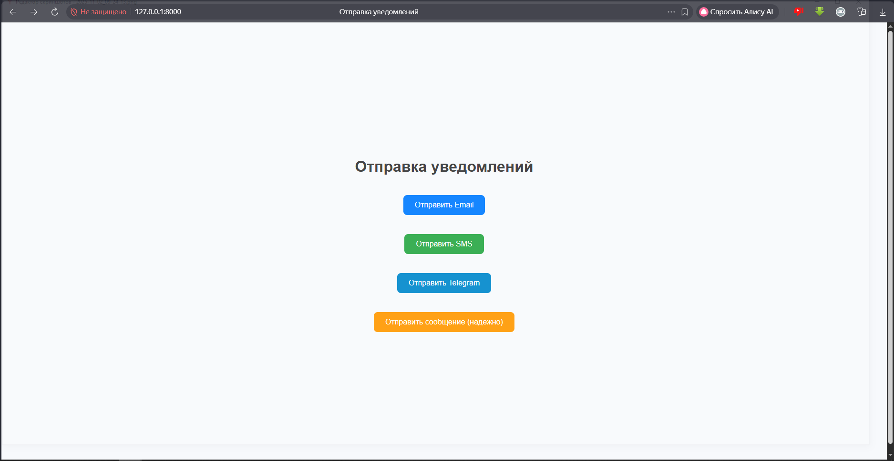
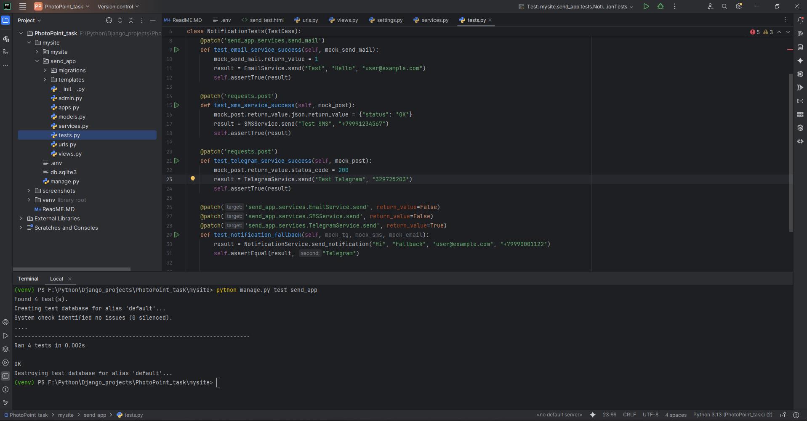

#  Тестовое задание для Photo Point

### Задача: Создать сервис для отправки уведомлений пользователям.
#### Требования: 
#### Пользователь может получать уведомления через:
*  Email
*  SMS
*  Telegram

##### Нужно обеспечить надежную доставку - если один способ не сработал, попробовать другой.
##### Время: до 2 дней

#### Приложение работает по адресу http://127.0.0.1:8000/send/

#### Так же присутствуют простые тесты (помимо тестов, кнопки протыканы вручную, отправка работает)

#### В проекте написаны только отправители сообщений.
#### Без БД и сборщика данных через личный кабинет.

